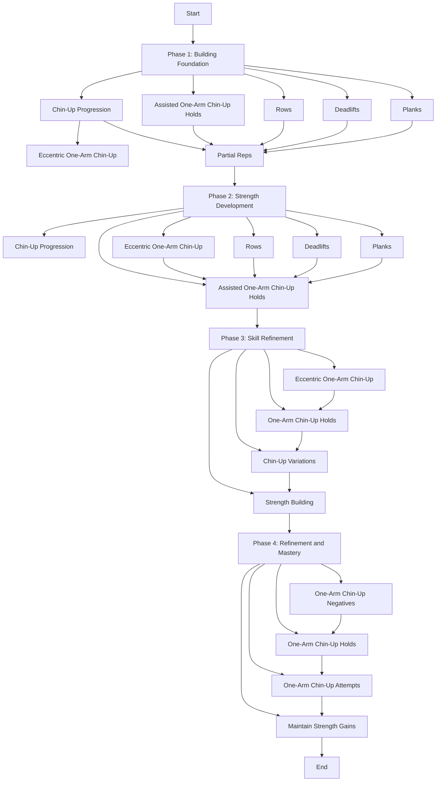

Specific one-year plan to work towards achieving a one-arm chin-up, starting from November 17, 2023. This plan is divided into phases, each focusing on different aspects of strength and skill development:

### Phase 1: Weeks 1-4 (Building Foundation)
Goals:
- Strengthen the upper body and core.
- Establish a baseline for chin-up performance.

#### Week 1-2:
- Perform 3-4 sessions per week.
- Each session:
  - Chin-up progression: 3 sets of 5-8 reps (use assistance if needed).
  - Assisted one-arm chin-up holds: 3 sets of 15-20 seconds each arm.
  - Rows: 3 sets of 8-10 reps.
  - Deadlifts: 3 sets of 8-10 reps.
  - Planks: 3 sets of 30-45 seconds.

#### Week 3-4:
- Increase the intensity:
- Chin-up progression: 4 sets of 6-10 reps (reduce assistance if possible).
- Assisted one-arm chin-up holds: 3 sets of 20-25 seconds each arm.
- Rows: 4 sets of 8-10 reps.
- Deadlifts: 4 sets of 8-10 reps.
- Planks: 3 sets of 45-60 seconds.

### Phase 2: Weeks 5-12 (Strength Development)
Goals:
- Increase overall strength and improve one-arm chin-up specific exercises.

#### Week 5-8:
- Perform 4 sessions per week.
- Each session:
  - Chin-up progression: 4 sets of 6-8 reps (reduce assistance or add weight).
  - Eccentric one-arm chin-up: 3 sets of 3-5 reps per arm (lowering phase).
  - Assisted one-arm chin-up holds: 4 sets of 25-30 seconds each arm.
  - Increase row and deadlift weight gradually.
  - Planks: 3 sets of 60 seconds.

#### Week 9-12:
- Increase intensity and decrease assistance:
- Chin-up progression: 4 sets of 5-7 reps (less assistance or added weight).
- Eccentric one-arm chin-up: 3 sets of 4-6 reps per arm.
- Assisted one-arm chin-up holds: 4 sets of 30-35 seconds each arm.
- Increase weight on rows and deadlifts.
- Planks: 3 sets of 60-75 seconds.

### Phase 3: Weeks 13-32 (Skill Refinement)
Goals:
- Mastering the technique and building specific strength for one-arm chin-ups.

#### Week 13-24:
- 4 sessions per week.
- Each session:
  - One-arm chin-up negatives: 3 sets of 3-5 reps per arm.
  - One-arm chin-up holds: 4 sets of 30-40 seconds each arm.
  - Chin-up variations: 4 sets of 5-7 reps.
  - Increase resistance in rows and deadlifts.
  - Planks: 3 sets of 60-90 seconds.

#### Week 25-32:
- Increase focus on one-arm chin-up progressions:
- One-arm chin-up negatives: 4 sets of 4-6 reps per arm.
- One-arm chin-up holds: 4 sets of 35-45 seconds each arm.
- Chin-up variations: 4 sets of 4-6 reps.
- Further increase resistance in rows and deadlifts.
- Planks: 3 sets of 60-90 seconds.

### Phase 4: Weeks 33-52 (Refinement and Mastery)
Goals:
- Refine technique, improve endurance, and work on achieving the one-arm chin-up.

#### Week 33-44:
- Maintain 4 sessions per week.
- Each session:
  - One-arm chin-up negatives: 4 sets of 4-6 reps per arm.
  - One-arm chin-up holds: 4 sets of 40-50 seconds each arm.
  - One-arm chin-up attempts: Start with assisted attempts and reduce assistance gradually.
  - Maintain or slightly increase resistance in rows and deadlifts.
  - Planks: 3 sets of 60-90 seconds.

#### Week 45-52:
- Intensify training:
- One-arm chin-up negatives: 4 sets of 5-7 reps per arm.
- One-arm chin-up holds: 4 sets of 45-55 seconds each arm.
- Frequent attempts at the one-arm chin-up (partial or assisted).
- Focus on maintaining strength gains.
- Planks: 3 sets of 60-120 seconds.

### Additional Tips:
- **Monitor Progress:** Keep a training log to track improvements in reps, sets, and holds.
- **Listen to Your Body:** Rest when needed and avoid overtraining.
- **Proper Nutrition:** Ensure a balanced diet with adequate protein for muscle repair and growth.
- **Flexibility and Mobility:** Incorporate stretching and mobility exercises to prevent injuries.

Remember, this plan provides a general framework. Adjustments may be necessary based on your individual progress, recovery, and any specific challenges you encounter. Always prioritize proper form and safety throughout your training. Good luck on your journey to achieving the one-arm chin-up!
